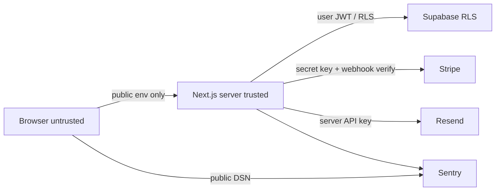

# OriginLedger architecture

OriginLedger is a single Next.js App Router application. The MVP uses Supabase for auth, Postgres, and file storage; Stripe for billing; Resend for transactional email; and Sentry for error reporting. This document is the canonical architecture for implementation milestones.

The product **supports documentation and transparency workflows**. Architecture, copy, and APIs must not claim legal certification or compliance.

## System context

```text
Browser
  |  HTTPS
  v
Next.js (App Router)  ---- Sentry (errors, server + client with DSN split)
  |-- Server Components, Server Actions, Route Handlers
  |-- Zod validation at every server boundary
  |
  +--> Supabase Auth (session cookies)
  +--> Supabase Postgres + RLS (tenant data)
  +--> Supabase Storage (documents)
  +--> Stripe (Checkout, Customer Portal, webhooks)
  +--> Resend (transactional email)
```

There is no separate API cluster in the MVP. Server-only modules in `src/` hold business rules. React components do not contain tenancy or billing logic.

## Stack

| Concern         | Choice                               | Notes                                                                                |
| --------------- | ------------------------------------ | ------------------------------------------------------------------------------------ |
| App             | Next.js App Router on Node.js 24 LTS | Server Components by default; `use client` only for browser interactivity            |
| Language        | TypeScript `strict`                  | No `any`, `@ts-ignore`, or unsafe casts to silence errors                            |
| Styling         | Tailwind CSS                         | Utility classes; no design-system package in Milestone 0                             |
| Package manager | pnpm                                 | Lockfile is required for install and CI                                              |
| Auth, DB, files | Supabase                             | RLS on every tenant table; Storage for documents                                     |
| Billing         | Stripe                               | Webhooks verified with the Stripe signing secret                                     |
| Email           | Resend                               | Server-only API key                                                                  |
| Observability   | Sentry                               | Separate public DSN vs auth token; no PII in events beyond what is required to debug |
| Tests           | Vitest, Testing Library, Playwright  | Unit/component tests in `src/`; e2e in `e2e/`                                        |

## Trust boundaries

1. **Browser (untrusted).** May receive only `NEXT_PUBLIC_*` values: app URL, Supabase URL, anon key, Stripe publishable key, Sentry DSN. Never receive the Supabase service-role key, Stripe secret key, Stripe webhook secret, Resend API key, or Sentry auth token.

2. **Next.js server (trusted compute).** Session-aware. Validates all external input with Zod. Enforces organization membership in service modules before mutating data. Uses the user-scoped Supabase client for tenant queries whenever possible so RLS remains the last line of defense.

3. **Supabase (data plane).** Postgres Row Level Security must deny cross-tenant reads and writes even if application code is wrong. Storage policies must be organization-scoped. The service-role key is server-only and is not used to bypass RLS in ordinary request paths.

4. **Stripe (billing plane).** Trusted only after webhook signature verification. Stripe is the source of subscription status. The app must not invent paid state.

5. **Resend (email plane).** Trusted only from the server. Email content must not include secrets or unpublished lot payloads.

6. **Sentry (telemetry plane).** Trusted as an error sink, not as an authorization system. Do not send service-role keys, webhook payloads with secrets, or document contents.

7. **Public verification pages (intentionally public).** Unauthenticated. Must only read rows and files explicitly published by the owning organization. Rate-limit and cache with care so they cannot enumerate unpublished lots.

8. **Packet share pages (capability-URL public).** Unauthenticated. Must reveal only the single packet bound to a hashed token. Invalid, expired, revoked, and rate-limited requests share a generic unavailable response. These pages do not inherit `/app` navigation and must not expose tenant menus, internal comments, storage paths, or other assets.



## Request path rules

- Default to Server Components.
- Mutations go through Server Actions or Route Handlers, then service modules.
- Zod schemas parse body, form, query, and webhook payloads before use.
- Every tenant query includes organization identity that the authenticated membership actually allows.
- Prefer the user-scoped Supabase client. Service role is reserved for tasks RLS cannot express (for example a verified Stripe webhook that must update billing columns). Those paths still constrain updates to the Stripe customer’s organization.

## Auth and session

Supabase Auth issues the session. The Next.js server reads cookies via `@supabase/ssr`. `src/proxy.ts` refreshes tokens with `getClaims()` on each matched request. Server Components and Server Actions verify identity with `getClaims()` again; they never trust `getSession()` for authorization. Client components do not persist service credentials. Password recovery uses the Auth confirmation route. Hosted invitation and auth mail via Resend waits for a later milestone.

## Data and RLS

- Tables that store organization data include `organization_id`. Composite foreign keys keep lots, events, and documents inside the same organization as their parent product or lot.
- RLS is enabled on every `public` application table. Client roles receive explicit GRANTs only (`supabase/config.toml` sets `auto_expose_new_tables = false`).
- Helper predicates live in the unexposed `private` schema as `security definer` functions with a fixed `search_path`. Policies call `(select auth.uid())` and those helpers. They never read `user_metadata`.
- Only `memberships.status = 'active'` grants tenant access. Invited, expired, and revoked memberships do not.
- Owner, admin, and operator may mutate operational records. Viewers are read-only. Owner and admin manage members, invitations, publish settings, and billing. Only the owner can request organization deletion. Owner and admin may `SELECT` `subscriptions`. `webhook_events`, `organization_exports`, and deletion-job tables are service-role only.
- Anonymous visitors may `SELECT` published lots and `is_publishable` events/documents. They have no GRANT on memberships, invitations, or subscriptions.
- Origin events are insert-mostly. A trigger rejects payload, kind, lot, and organization changes. Corrections set `status = 'superseded'` and `superseded_by`.
- `service_role` keeps full table grants and bypasses RLS. It is server-only (`SUPABASE_SERVICE_ROLE_KEY`, never `NEXT_PUBLIC_*`).
- Generated-compatible database types are checked in at `src/types/database.ts`. Regenerate with `pnpm supabase:types` after schema changes.
- Private origin-record files live in the `origin-assets` bucket. Generated evidence packets live in the separate private `evidence-packets` bucket under `exports/{uuid}` keys. Organization data exports live in the private `organization-exports` bucket under `org-exports/{uuid}` keys. Clients never receive the service-role key. Uploads use short-lived signed URLs for a server-generated object key. Packet and organization-export downloads stream through authorized server endpoints. Lot-linked `documents` remain a later milestone.
- Direct `DELETE` of an organization by an authenticated owner is not allowed. Deletion is a service-role job. Authenticated members cannot `SELECT` export or deletion-job tables. Append-only tenant history may be deleted with the tenant after storage verification; optional `organization_deletion_completions` rows contain only timestamps.

## Environment variables

Stripe Checkout or Customer Portal starts from authenticated server code. The client may submit a stable plan slug (`starter`, `agency`, `agency_plus`). The server resolves the Stripe price ID from allowlisted environment variables. Webhooks land on `/api/stripe/webhook`, which:

1. Reads the raw request body before JSON parsing.
2. Verifies the Stripe signature with `STRIPE_WEBHOOK_SECRET` and the official SDK (`2026-08-26.dahlia`).
3. Persists `stripe_event_id` on `webhook_events` (unique) and tracks `received` / `processed` / `failed`.
4. Retrieves the current Stripe subscription for subscription and invoice events instead of blindly applying an older payload.
5. Writes trusted billing columns on `subscriptions` in one `sync_organization_subscription` call. Stale Stripe timestamps do not regress newer local state.

Paid entitlements are computed from that local row plus `src/server/billing/plans.ts`. Checkout success is a processing state until a verified webhook confirms the subscription. Cancellation never deletes tenant data. Local CLI setup is documented in `docs/STRIPE_TEST_MODE.md`.

## Email

Resend sends invitation, authentication, and billing-related mail. Templates must repeat that OriginLedger does not certify compliance when origin records are mentioned.

## Observability

Sentry captures server, client, and edge exceptions when a DSN is set. `SENTRY_DSN` and `NEXT_PUBLIC_SENTRY_DSN` are optional; missing values leave the SDK inert. `SENTRY_AUTH_TOKEN` is CI/server-only and is never `NEXT_PUBLIC_`. Environments are `local`, `test`, `preview`, and `production`. Release identifiers come from deployment metadata when present. Source maps upload only when `SENTRY_UPLOAD_SOURCEMAPS=true` with org, project, and auth token, then are deleted after upload and hidden from public serving. `beforeSend` and `beforeBreadcrumb` run a shared allowlist scrubber. Session replay and traces are disabled. Structured server logs emit JSON in production with timestamp, severity, event name, environment, correlation ID, route template, status, duration, and error class only. `GET /api/health` returns `{ status, version }`.

Do not wrap RLS failures into generic 500s that hide tenancy bugs from tests.

## Environment variables

Typed parsing lives in `src/env`. Zod schemas validate values; empty strings are treated as unset.

| Module              | Import from                               | Contains                                   |
| ------------------- | ----------------------------------------- | ------------------------------------------ |
| `src/env/public.ts` | Server or Client Components               | `NEXT_PUBLIC_*` only                       |
| `src/env/server.ts` | Server-only code (`import "server-only"`) | Secret keys and other non-public variables |

Remaining service credentials (Resend) are optional until those milestones, but if set they must match the expected format. Sentry DSN values are optional; when absent, Sentry stays disabled. Stripe secret, webhook, and price variables are optional at parse time so CI can build without test-mode keys; Checkout, Portal, and webhook handling fail closed when they are missing, duplicated, or unknown. Validation errors name the variable and the rule. They never print the invalid value.

`next.config.ts` validates public variables during `next build` / `next dev`. `src/instrumentation.ts` validates public and server variables when the Node.js server starts.

Copy `.env.example` to `.env.local` for local work. Never commit `.env.local`.

## Repository layout (target)

- `src/app` — routes, layouts, Server Actions, Route Handlers
- `src/env` — typed public/server environment parsing
- `src/lib/supabase` — cookie-aware Supabase clients and session refresh
- `src/server` — service modules, Zod schemas, Supabase/Stripe/Resend access
- `src/types` — checked-in database types
- `supabase/migrations` — versioned schema and RLS
- `supabase/tests` — pgTAP access tests
- `src/server` — service modules, Zod schemas, Supabase/Stripe/Resend access (later milestones)
- `src/components` — UI that does not own business rules
- `e2e` — Playwright
- `docs` — canonical product, architecture, progress

## Security baseline

- `.env*` is gitignored except `.env.example`, which contains placeholders only, never real secrets.
- Public env modules must not read or re-export server-only keys.
- Environment validation errors must not echo secret values.
- CI uses `pnpm install --frozen-lockfile`.
- Husky + lint-staged format and lint staged files before commit.
- No production path uses mock data.
- Claims of legal compliance are forbidden in code, copy, and docs except to deny them.

## ADR log

### ADR-001: Next.js App Router as the application host

- **Status:** Accepted
- **Decision:** Ship a single Next.js App Router app with React Server Components.
- **Why:** One deployable, server-first rendering, and first-class Route Handlers for Stripe webhooks.
- **Consequences:** Browser interactivity requires explicit `use client`. Async Server Components are covered by Playwright, not Vitest.

### ADR-002: Supabase for auth, Postgres, and storage

- **Status:** Accepted
- **Decision:** Use Supabase rather than a self-hosted auth+db+files stack.
- **Why:** RLS, storage policies, and auth reduce custom security surface for a multi-tenant MVP.
- **Consequences:** Application code must still send organization-scoped queries. Service role is a break-glass credential, not a default client.

### ADR-003: Stripe Billing as the source of paid status

- **Status:** Accepted
- **Decision:** Stripe Checkout/Customer Portal plus verified webhooks.
- **Why:** Avoid storing card data and avoid inventing subscription state.
- **Consequences:** Local billing tests mock the Stripe SDK and use signed test payloads. Live test-mode keys stay in `.env.local`. See `docs/STRIPE_TEST_MODE.md`.

### ADR-004: Resend for transactional email

- **Status:** Accepted
- **Decision:** Send invitations and auth-related mail with Resend.
- **Why:** Simple server-side API; no inbox mock in production paths.
- **Consequences:** Environments without `RESEND_API_KEY` must fail closed for send operations.

### ADR-005: Sentry for error reporting

- **Status:** Accepted
- **Decision:** Report runtime errors with Sentry, splitting public DSN and server auth token.
- **Why:** Production incidents need stack traces without building an in-house pipeline.
- **Consequences:** Scrub secrets. Do not treat Sentry as an audit log for origin events.

### ADR-006: Node.js 24 LTS and pnpm

- **Status:** Accepted
- **Decision:** Pin Node.js 24.21.0 (active LTS at Milestone 0) and pnpm 12.4.2.
- **Why:** Reproducible installs and a supported Next.js 16 runtime.
- **Consequences:** Contributors must use the pinned Node version; CI reads `.nvmrc`.

### ADR-007: Vitest plus Playwright

- **Status:** Accepted
- **Decision:** Vitest and Testing Library for unit/component tests; Playwright Chromium for e2e smoke and later user journeys.
- **Why:** Matches current Next.js testing guides. Playwright covers the public landing page in Milestone 0.
- **Consequences:** `pnpm test` is non-watch CI mode. E2E runs against `next start` after `next build`.

### ADR-008: Zod-parsed environment with a public/server split

- **Status:** Accepted
- **Decision:** Parse environment variables with Zod. Put `NEXT_PUBLIC_*` in `src/env/public.ts`. Put secrets in `src/env/server.ts` behind `server-only`. Require `NEXT_PUBLIC_APP_URL` immediately. Keep unused service credentials optional until those milestones, and format-check them when present.
- **Why:** Fail closed on missing app URL without forcing dummy Stripe/Supabase secrets into CI or Playwright production builds. Prevent accidental client bundling of service-role and webhook secrets.
- **Consequences:** Authentication made `NEXT_PUBLIC_SUPABASE_URL` and `NEXT_PUBLIC_SUPABASE_ANON_KEY` required. Remaining service credentials stay optional until those milestones. CI sets public app URL and local-style Supabase placeholders for production-mode smoke tests.

### ADR-009: Local migrations as the schema source of truth

- **Status:** Accepted
- **Decision:** Version Postgres schema and RLS in `supabase/migrations`. Test policies with pgTAP via `supabase test db`. Keep `SUPABASE_SERVICE_ROLE_KEY` server-only. Do not apply these migrations to a hosted production database from Milestone 2.
- **Why:** RLS must deny cross-tenant access even if application code is wrong. Local Docker is the verification environment.
- **Consequences:** Contributors need Docker to run `pnpm supabase:start` and `pnpm supabase:test`. App CI stays runnable without Docker; a separate `database` GitHub Actions job starts the local stack.

### ADR-010: Cookie sessions with `@supabase/ssr` and Next.js Proxy

- **Status:** Accepted
- **Decision:** Use `@supabase/ssr` browser and server clients. Refresh the session in `src/proxy.ts` with `getClaims()`. Protect `/app` in Proxy as an optimistic check and again in the `/app` layout. Sign-up, sign-in, sign-out, and password recovery are Server Actions with Zod validation. PKCE email links land on `/auth/confirm`.
- **Why:** Server Components cannot write cookies; Proxy keeps refreshed tokens on the request and the browser. `getClaims()` verifies the JWT instead of trusting cookie contents.
- **Consequences:** `NEXT_PUBLIC_SUPABASE_URL` and `NEXT_PUBLIC_SUPABASE_ANON_KEY` are required. `SUPABASE_SERVICE_ROLE_KEY` stays server-only. Full organization invitations wait for a later milestone.

### ADR-011: Private signed uploads with trusted processing

- **Status:** Accepted
- **Decision:** Store origin-record files in a private `origin-assets` bucket. The Next.js server authorizes the user, generates a UUID object key, and issues a signed upload URL. After the client uploads, trusted server code downloads the object, verifies magic bytes, size, and SHA-256, then marks the asset `ready` or `processing_failed`. Preview uses a short-lived signed URL. Authenticated clients cannot UPDATE assets or set `ready`.
- **Why:** Browser filenames and MIME types are untrusted. RLS still hides other tenants’ rows. Signed URLs avoid exposing the service-role key while keeping the bucket private.
- **Consequences:** `SUPABASE_SERVICE_ROLE_KEY` is required for issuing upload/preview URLs and for processing. Allowed formats are PDF, JPEG, PNG, and WebP, 25 MB maximum, as documented in `docs/PRODUCT_SPEC.md`.

### ADR-012: Deterministic disclosure rules engine

- **Status:** Accepted
- **Decision:** Evaluate provenance declarations with a pure function versioned as `disclosure-rules.v1`. Zod validates the complete input before evaluation. English templates use identifiers plus interpolation data. Persist the exact ruleset version with every assessment. A human reviewer records the final decision; the engine never consults an LLM, network, database, or clock.
- **Why:** Identical inputs must produce identical recommendations. Application behavior must key off stable reason codes, not prose. The product supports documentation and transparency workflows and must not present automation as legal compliance.
- **Consequences:** Editing a reviewed declaration creates a new version. Changing inputs invalidates the current assessment. Localization later adds catalogs beside `DISCLOSURE_TEMPLATES` (English is `en` for v1) without rewriting `evaluateDisclosure`. Invitations remain a later milestone; they are not part of Milestone 5.

### ADR-014: Server-generated evidence packets and hashed share tokens

- **Status:** Accepted
- **Decision:** Generate PDF and JSON packets only on the server from `evidence-packet.v1`. Store objects in a private `evidence-packets` bucket. Share links store a SHA-256 of a 256-bit CSPRNG token. Rate-limit public share requests in Postgres with a replaceable limiter interface.
- **Why:** Clients cannot be trusted to assemble a consistent snapshot or to keep raw tokens. A capability URL must not become a tenant-data oracle or a public bucket.
- **Consequences:** Service role is required to stream share downloads and to increment rate-limit counters. Anon has no GRANT on export, share-link, or rate-limit tables. Schema changes require a new packet version.

### ADR-013: Tamper-evident evidence history

- **Status:** Accepted
- **Decision:** Record declaration and review actions as append-only `evidence_events` chained per asset. Canonicalize payloads with `canon-json.v1`, hash with SHA-256 hex (`sha256-hex.v1`), and verify only on the server. Describe the feature as tamper-evident or integrity-verified. Do not call it a blockchain or claim it is absolutely immutable or tamper-proof.
- **Why:** Review decisions need an auditable history that detects later row-level edits. A hash chain raises the cost of silent tampering without pretending the database administrator is untrusted.
- **Consequences:** Event creation is serialized per asset with a transaction advisory lock plus unique `(asset_id, sequence)` and `(asset_id, previous_hash)` constraints. Domain transitions and their evidence events are applied in one database function. Changing the hash contract requires a new versioned migration.

### Milestone 6 canonicalization (`canon-json.v1`)

Hash input object keys, after sorting, are exactly: `actor`, `asset_id`, `event_payload`, `event_type`, `organization_id`, `previous_hash`, `timestamp`.

| Kind        | Rule                                                                                        |
| ----------- | ------------------------------------------------------------------------------------------- |
| Object keys | Sorted by UTF-16 code-unit order (ECMAScript string `<`)                                    |
| Arrays      | Preserve order; each element is canonicalized                                               |
| Null        | Encoded as `null`. Omitted keys are absent and are not encoded as null                      |
| Strings     | JSON-escaped with `JSON.stringify` / `to_json`                                              |
| Unicode     | Canonical JSON text is hashed as UTF-8 bytes                                                |
| Numbers     | Finite safe integers only, decimal form without exponent or leading zeros (`0`, `-2`, `42`) |
| Booleans    | `true` / `false`                                                                            |
| Timestamps  | UTC ISO-8601 with milliseconds: `YYYY-MM-DDTHH:MM:SS.sssZ`                                  |
| Forbidden   | `NaN`, `Infinity`, floats, `undefined`, functions, secrets, raw prompts, signed URLs        |

`event_hash` is lowercase hex SHA-256 of those UTF-8 bytes. Genesis `previous_hash` is 64 zero hex characters. Sequence starts at `1`.

Trust boundary: the Next.js server and Postgres are trusted compute. A verifier recomputes hashes and links and reports the first break. It never repairs history. A successful result does not prove an administrator never replaced every row in the chain.

### Milestone 5 declaration versioning

- One declaration lineage exists per ready asset.
- Version numbers increment. `superseded_from_id` records lineage.
- At most one working version (`draft`, `pending_review`, or `changes_requested`) exists. Reviewed and rejected versions are immutable.
- Assessments store `ruleset_version`, reason codes, template id, interpolation data, rendered English text, and the human-review notice. Historical assessments keep the declaration version and ruleset they were produced with.
- `audit_events` are append-only. Metadata never includes raw prompts.

### Milestone 2 implementation assumptions

- Origin event `kind` values are the spec examples: `received`, `processed`, `transferred`, `documented`.
- `is_publishable` on origin events and documents is the flag that allows anonymous reads of otherwise member-only timeline rows.
- Membership `invited` / `expired` / `revoked` rows exist for history and do not grant access. Invitations are the pre-join email records.
- Creating an organization as the authenticated user inserts an `owner` + `active` membership in a trigger.
- Stripe customer and subscription identifiers live on `subscriptions` so a published organization row cannot leak billing IDs.
- Lot publish/unpublish/archive is owner or admin. Operators may move `draft` to `active` and append events on `active` or `published` lots.
- Lot-linked document bytes remain a later milestone. Project assets use the private `origin-assets` bucket introduced in Milestone 4.

### Milestone 7 evidence packets (`evidence-packet.v1`)

JSON packets are validated against a strict Zod schema before storage. Changing required fields, types, or nullability requires `evidence-packet.v2`. The PDF is rendered server-side from the same packet model with `pdf-lib`. User text is sanitized to WinAnsi-safe characters. Packets do not embed uploaded originals, remote scripts, or HTML.

Snapshot rules:

- Authorize the user for the organization, project, asset, and a mutating role before generation.
- Load organization, project, current declaration version, current assessment, latest review, and evidence events in one consistent read.
- Record the last loaded event as the chain head. Include history only through that event.
- Persist the declaration version, assessment, ruleset version, and review decision present at generation time.
- Hash the exact stored bytes with SHA-256 and keep that digest on `evidence_exports`.
- Regeneration inserts a new row. Historical export metadata cannot be updated.

Share-token rules:

- 32 CSPRNG bytes, base64url. Store SHA-256 hex only. Compare hashes with a fixed-length timing-safe check after hashing the presented token.
- Optional `expires_at`. Explicit revoke sets `status = revoked` and `revoked_at`.
- Public lookup uses the service-role client after hashing because anon has no SELECT on export or link tables. The token is the credential.
- Share access is not logged. Generation, create, and revoke write `audit_events` without tokens or raw prompts.

Rate limiting:

- Replaceable `ShareRateLimiter`. Production implementation: `public.consume_share_rate_limit` over `share_rate_limits`.
- Key: SHA-256 of `share-rate:{ipv4/24|ipv6/64}`. Window: 900 seconds. Limit: 20 requests.
- Apply before token lookup and packet download where practical. Fail closed to the generic unavailable response.
- Authenticated and anonymous clients cannot execute the limiter or read the table.

Share-page headers: `X-Robots-Tag: noindex, nofollow, noarchive`, `Cache-Control: private, no-store`, `Referrer-Policy: no-referrer`, plus matching robots/referrer meta tags. Title and description stay `Shared document` / `A documentation packet is available through a private link` for valid and invalid tokens.

### ADR-015: Server-owned plan catalog and reconciled Stripe subscriptions

- **Status:** Accepted
- **Decision:** Starter, Agency, and Agency Plus limits live in `src/server/billing/plans.ts`. Stripe price IDs come from server-only environment variables. Hosted Checkout and the Billing Portal are created only after owner/admin authorization. Webhooks verify the raw body, persist event IDs, retrieve current Stripe objects, and refuse stale timestamps. Member seats and monthly files are enforced in application code and in Postgres triggers that lock the organization subscription row.
- **Why:** Clients cannot be trusted with price IDs, customer IDs, or paid status. Duplicate or out-of-order Stripe events must not grant or revoke access incorrectly. Existing records above a downgraded limit must remain readable.
- **Consequences:** CI can build without Stripe keys. Checkout, Portal, and webhook routes fail closed when configuration is missing. `trial_will_end` is not handled until transactional email exists. Public lot verification remains a later milestone.

### Milestone 8 billing

- API version: `2026-08-26.dahlia`.
- Seat consumers: `memberships.status in (active, invited)` plus `invitations.status = pending`.
- Monthly files: assets in the organization with `created_at >= current_period_start` (or UTC month start) and `status <> processing_failed`.
- Grace: 3 days after `past_due_since`. After grace, unpaid limits apply even if Stripe has not sent another event.
- Data preservation: Stripe cancellation never deletes organizations, assets, packets, or history. Organization deletion later cancels the Stripe subscription and does not delete Stripe invoices or customers.

### ADR-016: Scrubbed Sentry, owner export, and controlled deletion

- **Status:** Accepted
- **Decision:** Initialize `@sentry/nextjs` for Node, browser, and edge with an allowlist scrubber, no default PII, and no replay or traces. Organization export and deletion are owner-only jobs with confirmation and password reauthentication. Storage objects are removed through the Storage API. Default deletion leaves no external audit record.
- **Why:** Production incidents need stack traces without leaking tenant content. Export and deletion are high-impact privacy operations.
- **Consequences:** Tests must not send telemetry to a real Sentry project. Privacy and terms pages stay draft placeholders until counsel review. Resend email and public lot verification remain later milestones.

### Milestone 9 observability and privacy

- Sentry files: `src/instrumentation.ts`, `src/instrumentation-client.ts`, `src/sentry.server.config.ts`, `src/sentry.edge.config.ts`. `next.config.ts` wraps with `withSentryConfig` from `@sentry/nextjs/config`.
- Source maps: `productionBrowserSourceMaps` is false. Upload runs only when `SENTRY_UPLOAD_SOURCEMAPS=true` with `SENTRY_ORG`, `SENTRY_PROJECT`, and `SENTRY_AUTH_TOKEN`. Client maps under `.next/static/**/*.map` are deleted after upload. The auth token is never `NEXT_PUBLIC_`.
- Correlation header: `x-correlation-id`. Invalid inbound values are replaced with a UUID. AsyncLocalStorage isolates concurrent Node requests.
- Health: `GET /api/health` returns `{ status, version }` only.
- Export schema: `organization-export.v1`.
- Deletion steps: mark_pending, revoke_access, detach_billing, inventory, delete_origin_assets, delete_evidence_packets, delete_organization_exports, verify_storage, delete_rows, verify_rows, finalize.
- Authenticated clients have no GRANT on export/deletion job tables and cannot DELETE organizations. Service-role purge uses `originledger.purge_organization`.
- Append-only evidence events are not rewritten. They are deleted with the tenant after storage verification.
- Default finalize removes job rows. `ORGANIZATION_DELETION_RETENTION_DAYS` may keep a timestamp-only completion row pending counsel review.
