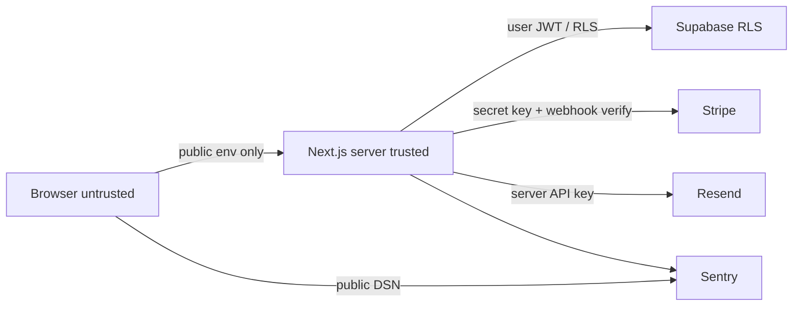

# OriginLedger architecture

OriginLedger is a single Next.js App Router application. The MVP uses Supabase for auth, Postgres, and file storage; Stripe for billing; Resend for transactional email; and Sentry for error reporting. This document is the canonical architecture for implementation milestones.

The product **supports documentation and transparency workflows**. Architecture, copy, and APIs must not claim legal certification or compliance.

## System context

```text
Browser
  |  HTTPS
  v
Next.js (App Router)  ---- Sentry (errors, server + client with DSN split)
  |-- Server Components, Server Actions, Route Handlers
  |-- Zod validation at every server boundary
  |
  +--> Supabase Auth (session cookies)
  +--> Supabase Postgres + RLS (tenant data)
  +--> Supabase Storage (documents)
  +--> Stripe (Checkout, Customer Portal, webhooks)
  +--> Resend (transactional email)
```

There is no separate API cluster in the MVP. Server-only modules in `src/` hold business rules. React components do not contain tenancy or billing logic.

## Stack

| Concern         | Choice                               | Notes                                                                                |
| --------------- | ------------------------------------ | ------------------------------------------------------------------------------------ |
| App             | Next.js App Router on Node.js 24 LTS | Server Components by default; `use client` only for browser interactivity            |
| Language        | TypeScript `strict`                  | No `any`, `@ts-ignore`, or unsafe casts to silence errors                            |
| Styling         | Tailwind CSS                         | Utility classes; no design-system package in Milestone 0                             |
| Package manager | pnpm                                 | Lockfile is required for install and CI                                              |
| Auth, DB, files | Supabase                             | RLS on every tenant table; Storage for documents                                     |
| Billing         | Stripe                               | Webhooks verified with the Stripe signing secret                                     |
| Email           | Resend                               | Server-only API key                                                                  |
| Observability   | Sentry                               | Separate public DSN vs auth token; no PII in events beyond what is required to debug |
| Tests           | Vitest, Testing Library, Playwright  | Unit/component tests in `src/`; e2e in `e2e/`                                        |

## Trust boundaries

1. **Browser (untrusted).** May receive only `NEXT_PUBLIC_*` values: app URL, Supabase URL, anon key, Stripe publishable key, Sentry DSN. Never receive the Supabase service-role key, Stripe secret key, Stripe webhook secret, Resend API key, or Sentry auth token.

2. **Next.js server (trusted compute).** Session-aware. Validates all external input with Zod. Enforces organization membership in service modules before mutating data. Uses the user-scoped Supabase client for tenant queries whenever possible so RLS remains the last line of defense.

3. **Supabase (data plane).** Postgres Row Level Security must deny cross-tenant reads and writes even if application code is wrong. Storage policies must be organization-scoped. The service-role key is server-only and is not used to bypass RLS in ordinary request paths.

4. **Stripe (billing plane).** Trusted only after webhook signature verification. Stripe is the source of subscription status. The app must not invent paid state.

5. **Resend (email plane).** Trusted only from the server. Email content must not include secrets or unpublished lot payloads.

6. **Sentry (telemetry plane).** Trusted as an error sink, not as an authorization system. Do not send service-role keys, webhook payloads with secrets, or document contents.

7. **Public verification pages (intentionally public).** Unauthenticated. Must only read rows and files explicitly published by the owning organization. Rate-limit and cache with care so they cannot enumerate unpublished lots.



## Request path rules

- Default to Server Components.
- Mutations go through Server Actions or Route Handlers, then service modules.
- Zod schemas parse body, form, query, and webhook payloads before use.
- Every tenant query includes organization identity that the authenticated membership actually allows.
- Prefer the user-scoped Supabase client. Service role is reserved for tasks RLS cannot express (for example a verified Stripe webhook that must update billing columns). Those paths still constrain updates to the Stripe customer’s organization.

## Auth and session

Supabase Auth issues the session. The Next.js server reads cookies via the official `@supabase/ssr` patterns (introduced in a later milestone). Client components do not persist service credentials. Password recovery and invitations use Resend, not a mock mailbox.

## Data and RLS

- Tables that store organization data include `organization_id`. Composite foreign keys keep lots, events, and documents inside the same organization as their parent product or lot.
- RLS is enabled on every `public` application table. Client roles receive explicit GRANTs only (`supabase/config.toml` sets `auto_expose_new_tables = false`).
- Helper predicates live in the unexposed `private` schema as `security definer` functions with a fixed `search_path`. Policies call `(select auth.uid())` and those helpers. They never read `user_metadata`.
- Only `memberships.status = 'active'` grants tenant access. Invited, expired, and revoked memberships do not.
- Owner, admin, and operator may mutate operational records. Viewers are read-only. Owner and admin manage members, invitations, and publish settings. Only the owner can delete an organization or read `subscriptions`.
- Anonymous visitors may `SELECT` published lots and `is_publishable` events/documents. They have no GRANT on memberships, invitations, or subscriptions.
- Origin events are insert-mostly. A trigger rejects payload, kind, lot, and organization changes. Corrections set `status = 'superseded'` and `superseded_by`.
- `service_role` keeps full table grants and bypasses RLS. It is server-only (`SUPABASE_SERVICE_ROLE_KEY`, never `NEXT_PUBLIC_*`).
- Generated-compatible database types are checked in at `src/types/database.ts`. Regenerate with `pnpm supabase:types` after schema changes.
- Storage buckets and file upload policies are Milestone 6. The `documents` table stores metadata and `storage_path` only.

## Environment variables

Stripe Checkout or Customer Portal starts from the server. Webhooks land on a Route Handler that:

1. Verifies the signature with `STRIPE_WEBHOOK_SECRET`.
2. Parses the event with Zod or Stripe’s typed helpers plus explicit field checks.
3. Updates the organization subscription in a narrowly scoped write.

The UI renders Stripe-backed status only.

## Email

Resend sends invitation, authentication, and billing-related mail. Templates must repeat that OriginLedger does not certify compliance when origin records are mentioned.

## Observability

Sentry captures server exceptions and selected client errors. Source maps use `SENTRY_AUTH_TOKEN` in CI, never in the browser. Do not wrap RLS failures into generic 500s that hide tenancy bugs from tests.

## Environment variables

Typed parsing lives in `src/env`. Zod schemas validate values; empty strings are treated as unset.

| Module              | Import from                               | Contains                                   |
| ------------------- | ----------------------------------------- | ------------------------------------------ |
| `src/env/public.ts` | Server or Client Components               | `NEXT_PUBLIC_*` only                       |
| `src/env/server.ts` | Server-only code (`import "server-only"`) | Secret keys and other non-public variables |

`NEXT_PUBLIC_APP_URL` is required at build and server start. Service credentials (Supabase, Stripe, Resend, Sentry) are optional until their milestones, but if set they must match the expected format. Validation errors name the variable and the rule. They never print the invalid value.

`next.config.ts` validates public variables during `next build` / `next dev`. `src/instrumentation.ts` validates public and server variables when the Node.js server starts.

Copy `.env.example` to `.env.local` for local work. Never commit `.env.local`.

## Repository layout (target)

- `src/app` — routes, layouts, Server Actions, Route Handlers
- `src/env` — typed public/server environment parsing
- `src/types` — checked-in database types
- `supabase/migrations` — versioned schema and RLS
- `supabase/tests` — pgTAP access tests
- `src/server` — service modules, Zod schemas, Supabase/Stripe/Resend access (later milestones)
- `src/components` — UI that does not own business rules
- `e2e` — Playwright
- `docs` — canonical product, architecture, progress

## Security baseline

- `.env*` is gitignored except `.env.example`, which contains placeholders only, never real secrets.
- Public env modules must not read or re-export server-only keys.
- Environment validation errors must not echo secret values.
- CI uses `pnpm install --frozen-lockfile`.
- Husky + lint-staged format and lint staged files before commit.
- No production path uses mock data.
- Claims of legal compliance are forbidden in code, copy, and docs except to deny them.

## ADR log

### ADR-001: Next.js App Router as the application host

- **Status:** Accepted
- **Decision:** Ship a single Next.js App Router app with React Server Components.
- **Why:** One deployable, server-first rendering, and first-class Route Handlers for Stripe webhooks.
- **Consequences:** Browser interactivity requires explicit `use client`. Async Server Components are covered by Playwright, not Vitest.

### ADR-002: Supabase for auth, Postgres, and storage

- **Status:** Accepted
- **Decision:** Use Supabase rather than a self-hosted auth+db+files stack.
- **Why:** RLS, storage policies, and auth reduce custom security surface for a multi-tenant MVP.
- **Consequences:** Application code must still send organization-scoped queries. Service role is a break-glass credential, not a default client.

### ADR-003: Stripe Billing as the source of paid status

- **Status:** Accepted
- **Decision:** Stripe Checkout/Customer Portal plus verified webhooks.
- **Why:** Avoid storing card data and avoid inventing subscription state.
- **Consequences:** Local and CI billing tests need Stripe test-mode keys when that milestone lands; until then, billing code is absent.

### ADR-004: Resend for transactional email

- **Status:** Accepted
- **Decision:** Send invitations and auth-related mail with Resend.
- **Why:** Simple server-side API; no inbox mock in production paths.
- **Consequences:** Environments without `RESEND_API_KEY` must fail closed for send operations.

### ADR-005: Sentry for error reporting

- **Status:** Accepted
- **Decision:** Report runtime errors with Sentry, splitting public DSN and server auth token.
- **Why:** Production incidents need stack traces without building an in-house pipeline.
- **Consequences:** Scrub secrets. Do not treat Sentry as an audit log for origin events.

### ADR-006: Node.js 24 LTS and pnpm

- **Status:** Accepted
- **Decision:** Pin Node.js 24.21.0 (active LTS at Milestone 0) and pnpm 12.4.2.
- **Why:** Reproducible installs and a supported Next.js 16 runtime.
- **Consequences:** Contributors must use the pinned Node version; CI reads `.nvmrc`.

### ADR-007: Vitest plus Playwright

- **Status:** Accepted
- **Decision:** Vitest and Testing Library for unit/component tests; Playwright Chromium for e2e smoke and later user journeys.
- **Why:** Matches current Next.js testing guides. Playwright covers the public landing page in Milestone 0.
- **Consequences:** `pnpm test` is non-watch CI mode. E2E runs against `next start` after `next build`.

### ADR-008: Zod-parsed environment with a public/server split

- **Status:** Accepted
- **Decision:** Parse environment variables with Zod. Put `NEXT_PUBLIC_*` in `src/env/public.ts`. Put secrets in `src/env/server.ts` behind `server-only`. Require `NEXT_PUBLIC_APP_URL` immediately. Keep unused service credentials optional until those milestones, and format-check them when present.
- **Why:** Fail closed on missing app URL without forcing dummy Stripe/Supabase secrets into CI or Playwright production builds. Prevent accidental client bundling of service-role and webhook secrets.
- **Consequences:** Later service milestones must tighten those variables to required when the matching production path is introduced. CI sets `NEXT_PUBLIC_APP_URL` to the smoke-test origin.

### ADR-009: Local migrations as the schema source of truth

- **Status:** Accepted
- **Decision:** Version Postgres schema and RLS in `supabase/migrations`. Test policies with pgTAP via `supabase test db`. Keep `SUPABASE_SERVICE_ROLE_KEY` server-only. Do not apply these migrations to a hosted production database from Milestone 2.
- **Why:** RLS must deny cross-tenant access even if application code is wrong. Local Docker is the verification environment.
- **Consequences:** Contributors need Docker to run `pnpm supabase:start` and `pnpm supabase:test`. App CI stays runnable without Docker; a separate `database` GitHub Actions job starts the local stack.

### Milestone 2 implementation assumptions

- Origin event `kind` values are the spec examples: `received`, `processed`, `transferred`, `documented`.
- `is_publishable` on origin events and documents is the flag that allows anonymous reads of otherwise member-only timeline rows.
- Membership `invited` / `expired` / `revoked` rows exist for history and do not grant access. Invitations are the pre-join email records.
- Creating an organization as the authenticated user inserts an `owner` + `active` membership in a trigger.
- Stripe customer and subscription identifiers live on `subscriptions` so a published organization row cannot leak billing IDs.
- Lot publish/unpublish/archive is owner or admin. Operators may move `draft` to `active` and append events on `active` or `published` lots.
- Document file bytes and Storage bucket policies wait for Milestone 6.
